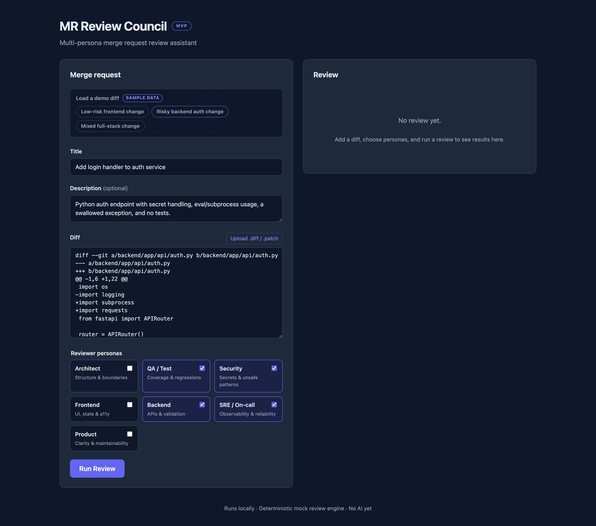
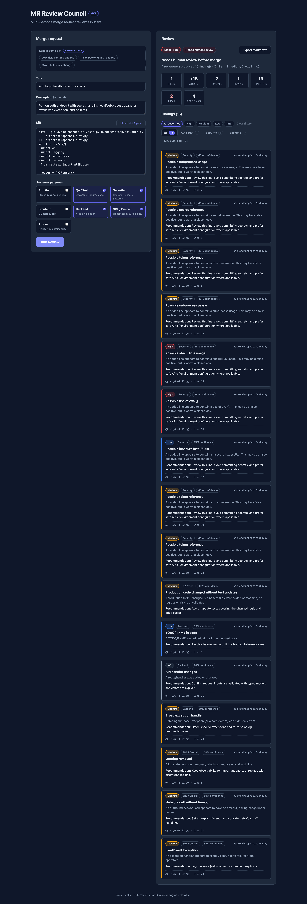
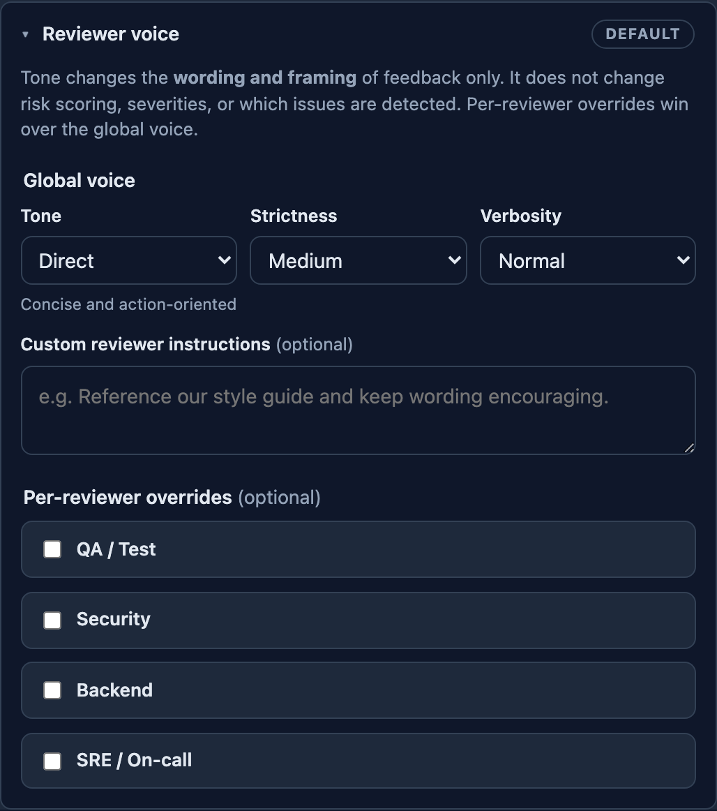
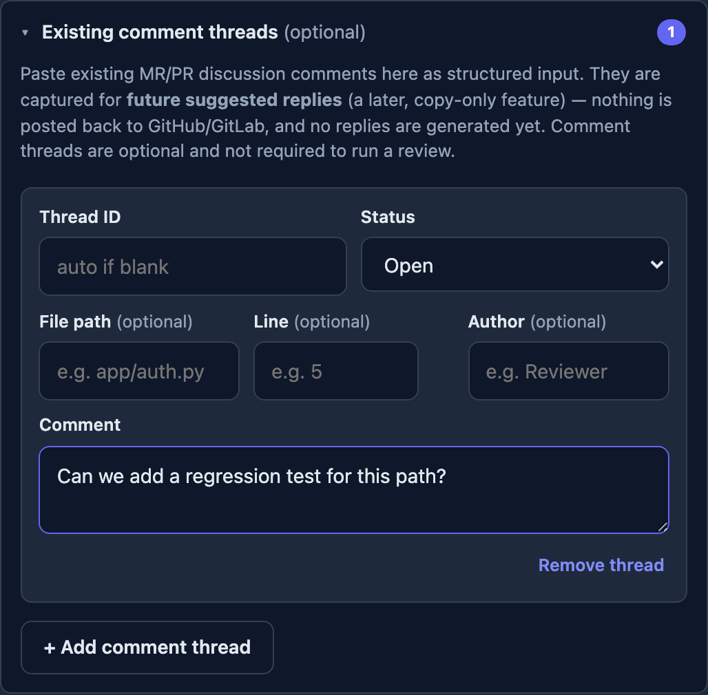
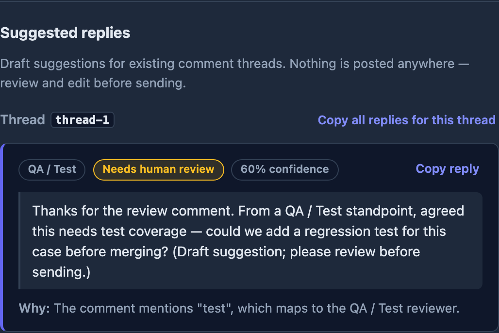
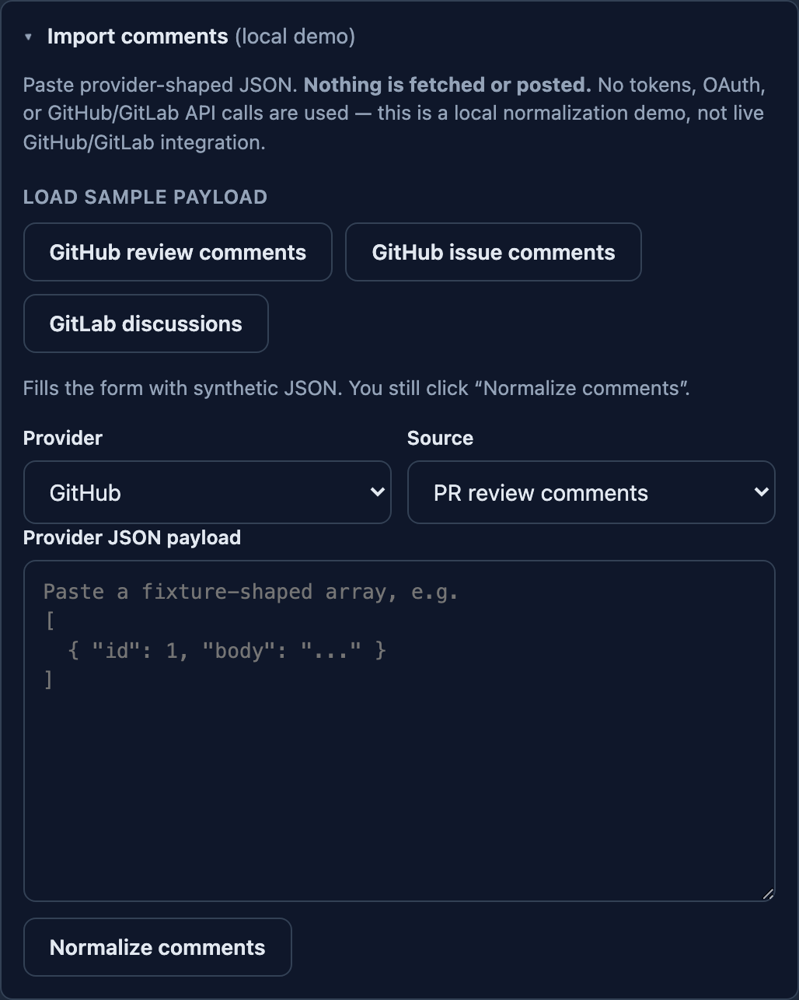
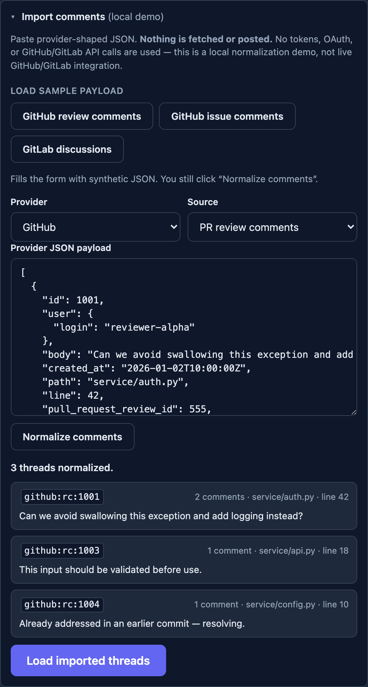
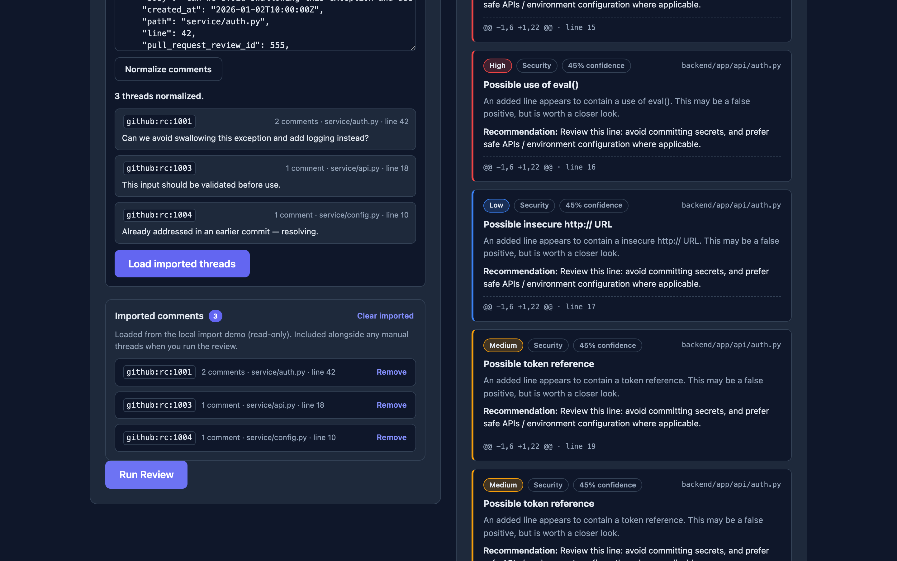
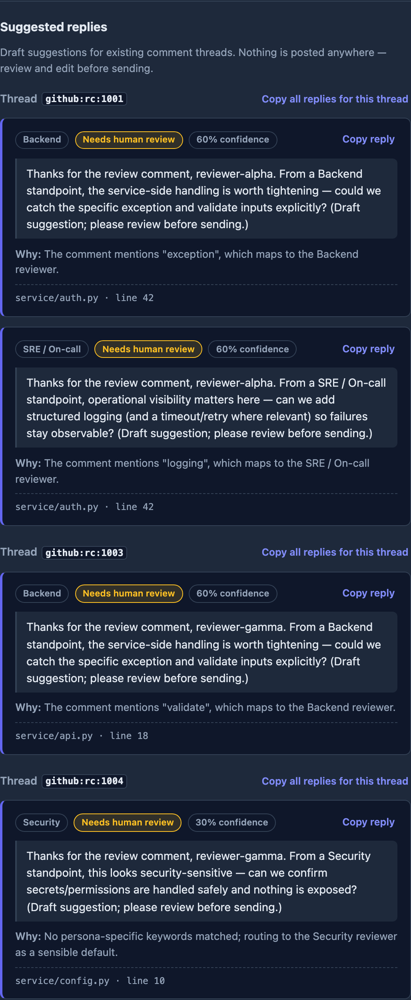

# To Review or Not To Review

> **Product / demo name:** MR Review Council — a multi-persona merge-request review assistant.

MR Review Council reviews a Git merge-request / pull-request diff through several
distinct engineering perspectives — **Architect, QA, Security, Frontend, Backend,
SRE, and Product** — and returns a structured review: an overall risk level, a
merge recommendation, and per-persona findings you can filter, read, and export
to Markdown.

The entire project runs **locally with no cloud credentials and no paid APIs**.
Reviews are produced by a deterministic *mock* provider behind a clean, pluggable
interface, so a real Amazon Bedrock / OpenAI / Anthropic provider can drop in later
**without changing the API or the UI**. It is an architecture demonstration, shipped
in three tagged milestones (`v0.1.0`, `v0.2.0`, `v0.3.0`).

---

## What this demonstrates

- **Full-stack product design** — a typed React/TypeScript frontend and a
  FastAPI/Pydantic backend connected by a single, contract-first JSON boundary.
- **Architecture before spend** — a deterministic mock provider proves the whole
  diff → review → verdict flow end to end behind a provider seam, so real AI can be
  added later as an isolated change (no API/UI churn).
- **Incremental delivery** — three exact, runnable Git tags, each adding a coherent
  capability: core review (`v0.1`), reviewer tone + comment threads + suggested
  replies (`v0.2`), and a local fixture-based comment-import demo (`v0.3`).
- **Decoupling via contracts** — a normalized comment-thread contract lets imported
  provider-shaped data flow through the *exact* same review/reply path as
  locally-entered data, proven by invariance tests.
- **Test & demo discipline** — 161 backend tests, 56 frontend tests, and Playwright
  demo automation that captures real screenshots/videos from each tagged build.

## Project scope

**Implemented**

- Multi-persona review over a parsed unified diff → overall risk, merge
  recommendation, per-persona findings, Markdown export.
- Deterministic mock review provider behind a `ReviewProvider` interface selected by
  `REVIEW_PROVIDER` (with a `bedrock` placeholder that returns a clear `501`).
- Reviewer **tone profiles** (presentation only) and deterministic, **copy-only**
  suggested replies for existing comment threads.
- **Local, fixture-based** GitHub/GitLab comment **import** that normalizes
  provider-shaped JSON into the comment-thread contract.
- Playwright demo automation; exact-version screenshots and videos.

**Planned / deferred (designed, not built)**

- A real `BedrockReviewProvider` behind the existing seam.
- Live GitHub/GitLab fetching of diffs and comments by URL.
- Persistence (review history), authentication, and deployment automation.

**Intentionally not included**

- ❌ Live GitHub/GitLab API calls · ❌ OAuth / token input · ❌ comment posting or
  auto-reply · ❌ real AI/LLM review generation · ❌ a hosted/production deployment.

## Demo by version

Screenshots and videos are **real captures from the matching tagged build** (see
[Screenshots](#screenshots) for the full gallery and
[`frontend/demo/README.md`](frontend/demo/README.md) for how they were captured):

| Version | What it adds | Screenshots | Video |
| ------- | ------------ | ----------- | ----- |
| **v0.1.0** | Core multi-persona review + Markdown export | [v0.1 gallery](#v01--core-review-mvp-from-the-v010-tag) | [core-review demo](docs/assets/videos/mr-review-council-v0.1-core-review-demo.webm) |
| **v0.2.0** | Reviewer tone, comment threads, suggested replies | [v0.2 gallery](#v02--reviewer-tone-comment-threads-suggested-replies-from-the-v020-tag) | [suggested-replies demo](docs/assets/videos/mr-review-council-v0.2-suggested-replies-demo.webm) |
| **v0.3.0** | Local fixture-based comment import | [v0.3 gallery](#v03--local-fixture-based-comment-import-demo-generated-from-v030) | [local-import demo](docs/assets/videos/mr-review-council-v0.3-local-import-demo.webm) |

## Why this project exists

Code review is where a lot of engineering judgment lives, but a single reviewer
rarely holds every lens at once — security, testing, reliability, architecture,
product. This project explores what an automated "review council" could look
like: many specialized reviewers over one diff, each with a clear focus, rolled
up into a single risk/recommendation verdict.

The design goal was to build the *architecture* of an AI-assisted reviewer — a clean
diff → review → aggregation pipeline behind a provider seam — and prove the full flow
end to end **before** spending on tokens or standing up cloud infrastructure. The
mock provider keeps the app free, fast, deterministic, and easy to clone and run.

## Key features

- **Multi-persona review** — 7 reviewer personas, each with its own focus,
  output expectations, and severity guidance (`backend/app/personas/registry.py`).
- **Real unified-diff parsing** — raw `diff`/`patch` text → structured files /
  hunks / lines / stats (`backend/app/services/diff_parser.py`).
- **Deterministic mock review engine** — credible, repeatable findings from
  heuristics; no AI, no flakiness.
- **Aggregated verdict** — overall risk level + a merge recommendation
  (`ready` → `needs human review`) derived from all findings.
- **Pluggable provider interface** — `REVIEW_PROVIDER` selects the backend;
  a Bedrock placeholder shows exactly where a real model plugs in.
- **Polished review dashboard** — risk/recommendation badges, diff stats,
  reviewer tabs, severity filters, and detailed finding cards.
- **Diff input three ways** — paste, upload a `.diff`/`.patch`, or load a
  built-in demo sample.
- **Markdown export** — download the full review as a clean `.md` report to paste
  into a GitLab MR / GitHub PR comment.
- **Tested** — backend parser/engine/provider/route tests; type-checked frontend.

## Tech stack

- **Frontend:** React + TypeScript + Vite (plain CSS, no UI framework)
- **Backend:** Python + FastAPI + Pydantic v2
- **Tests:** pytest (backend), `tsc` type-check + `vite build` (frontend)
- **Future / designed-for:** AWS (Amazon Bedrock for reviews; API Gateway/Lambda
  or ECS for hosting; DynamoDB + S3 for persistence)

## Architecture overview

In one breath: a **React/TypeScript** frontend and a **FastAPI/Pydantic** backend
share a contract-first JSON boundary; review generation sits behind a **deterministic
provider abstraction**; existing discussions flow through a **normalized
comment-thread contract** (the same path whether entered locally or imported from
provider-shaped JSON); and **Playwright demo automation** captures the assets.

```text
Frontend (React/TS/Vite)                 Backend (FastAPI/Pydantic)
┌─────────────────────────┐  POST /api   ┌────────────────────────────────────────┐
│ Diff input (paste/upload │ ──/reviews─► │ diff_parser   → ParsedDiff             │
│   /demo) + persona pick  │              │ review_engine → aggregates results     │
│ Risk/verdict dashboard   │ ◄──JSON───── │   create_provider(REVIEW_PROVIDER)     │
│ Tabs · filters · cards   │              │     ReviewProvider (interface)         │
│ Export to Markdown       │              │       MockReviewProvider  (default)    │
└─────────────────────────┘              │       BedrockReviewProvider (placeholder)│
                                          │ personas/registry → PersonaSpec(s)     │
                                          └────────────────────────────────────────┘
```

The frontend POSTs a diff plus the selected personas. The backend parses the
unified diff, asks the configured `ReviewProvider` for one review per persona,
and aggregates a structured response (overall risk, merge recommendation,
summary, diff stats, per-persona findings, flattened findings). The API contract
is identical regardless of which provider runs.

See [`docs/architecture.md`](docs/architecture.md) for the detailed flow and a
Mermaid diagram, and [`docs/decisions.md`](docs/decisions.md) for the decision
log.

### Repository layout

```text
.
├── backend/    # FastAPI app: parser, review engine, providers, personas, tests
├── frontend/   # React + TypeScript + Vite app
├── docs/       # Architecture, decisions, review contract, samples
└── README.md
```

## Local setup

You need **Node.js 18+** and **Python 3.11+** installed.

### Backend

```bash
cd backend
python -m venv .venv
source .venv/bin/activate        # Windows: .venv\Scripts\activate
pip install -r requirements.txt
uvicorn app.main:app --reload --port 8000
```

The API is then available at `http://localhost:8000` (health check:
`http://localhost:8000/health`, interactive docs: `http://localhost:8000/docs`).

### Frontend

```bash
cd frontend
npm install
npm run dev
```

The dev server runs at `http://localhost:5173` and proxies `/api` to the backend
at `http://localhost:8000`.

### API endpoints

| Method | Path              | Description                                    |
| ------ | ----------------- | ---------------------------------------------- |
| GET    | `/health`         | Liveness probe, returns `{"status":"ok"}`      |
| POST   | `/api/parse-diff` | Parse unified diff text into a `ParsedDiff`     |
| POST   | `/api/reviews`    | Run selected personas, return a `ReviewResponse` |

## Demo walkthrough

The app ships with built-in sample diffs so you can show it off without a real
merge request.

1. Start the backend and frontend (see [Local setup](#local-setup)).
2. Open `http://localhost:5173`. In the **Merge request** panel, use **Load a
   demo diff** (marked *sample data*) and pick a sample. It fills in the title,
   description, diff, and a recommended set of personas — **nothing runs
   automatically**.
3. Click **Run Review**.

Which sample to use:

- **Low-risk frontend change** — a small React component tweak *with* a matching
  test update. Produces a mostly clean review (good for showing the "looks clean"
  states and a `ready` recommendation).
- **Risky backend auth change** — a Python auth endpoint with secret handling,
  `eval`/`subprocess`/`shell=True`, a swallowed exception, a no-timeout network
  call, and no tests. Triggers Security (incl. high), QA, Backend, and SRE
  findings and a `needs human review` recommendation.
- **Mixed full-stack change** — touches frontend, backend, config, and docs in
  one MR. Triggers Architect (scope/boundaries) and Product/QA feedback.

Then explore the results: switch **reviewer tabs**, apply **severity filters**,
read the finding cards, and click **Export Markdown**. The paste-your-own and
`.diff`/`.patch` upload workflows work exactly the same way.

## Demo video

Short (≤90s) walkthroughs are **recorded from real app interactions** by the Playwright
video specs (`frontend/demo/videos/`) and saved under
[`docs/assets/videos/`](docs/assets/videos/):

| Milestone | Video |
| --------- | ----- |
| v0.1 core review | [`mr-review-council-v0.1-core-review-demo.webm`](docs/assets/videos/mr-review-council-v0.1-core-review-demo.webm) *(recorded from the `v0.1.0` tag)* |
| v0.2 suggested replies | [`mr-review-council-v0.2-suggested-replies-demo.webm`](docs/assets/videos/mr-review-council-v0.2-suggested-replies-demo.webm) *(recorded from the `v0.2.0` tag)* |
| v0.3 local import | [`mr-review-council-v0.3-local-import-demo.webm`](docs/assets/videos/mr-review-council-v0.3-local-import-demo.webm) *(recorded from the `v0.3.0` tag)* |

The v0.1/v0.2 videos were recorded by running the **current** Playwright harness against
the **historical** app started from the matching `v0.1.0` / `v0.2.0` worktree, via
`DEMO_BASE_URL` (old tags don't ship the `demo:*` scripts) — see
[`frontend/demo/README.md`](frontend/demo/README.md). The v0.3 import video is
a **local fixture-based demo** (bundled synthetic JSON) — **not** live GitHub/GitLab
integration. Converting `.webm` to
`.mp4`/`.gif` with `ffmpeg` is **optional** and not required.

A ready-to-record script, narration, timing guide, and recording checklist live in
[`docs/demo-script.md`](docs/demo-script.md).

## Running tests and builds

Backend tests (parser, review engine, providers, routes, and edge cases):

```bash
cd backend && source .venv/bin/activate
python -m pytest -q
```

Frontend tests (Vitest + React Testing Library) and the production build:

```bash
cd frontend
npm test           # run the Vitest suite once
npm run test:watch # watch mode
npm run build      # type-check (`tsc -b`) + production build (`vite build`)
```

## Provider architecture

Review generation lives behind a single `ReviewProvider` interface
(`backend/app/services/providers/base.py`):

```python
review(parsed_diff, selected_personas, title=None, description=None) -> list[PersonaReview]
```

The provider is chosen by the `REVIEW_PROVIDER` environment variable, resolved by
a small factory (`create_provider`) that validates the value:

| `REVIEW_PROVIDER` | Behavior                                                          |
| ----------------- | ----------------------------------------------------------------- |
| `mock` *(default)*| Deterministic, offline heuristics. No AI, no credentials.         |
| `bedrock`         | Placeholder seam. Returns a clear **501**, not a fake review.     |
| *anything else*   | Fails fast with a `ValueError` listing the valid options.         |

```bash
# Default — fully local, deterministic:
uvicorn app.main:app --reload --port 8000

# Explicit:
REVIEW_PROVIDER=mock uvicorn app.main:app --reload --port 8000

# Placeholder — /api/reviews responds 501 with an explanatory message:
REVIEW_PROVIDER=bedrock uvicorn app.main:app --reload --port 8000
```

Persona knowledge (display name, review focus, output expectations, severity
guidance) lives once in `backend/app/personas/registry.py`, so the mock provider
and any future LLM provider build from the same source of truth.

**Why real AI calls are intentionally deferred:** keeping reviews deterministic
and offline means the app runs for free with no credentials, the test suite stays
fast and deterministic, and the extensibility seam is proven before spending on
tokens. Adding Bedrock later is an isolated change inside `BedrockReviewProvider`.

## Markdown export

From the results panel, **Export Markdown** downloads a `.md` report built
entirely client-side (`frontend/src/lib/exportMarkdown.ts`). The report always
reflects the **full review** — every persona and every finding — independent of
the reviewer/severity filters applied in the UI. It includes an overview
(risk, recommendation, diff stats), the council summary, and findings grouped by
reviewer with file/location/confidence. See
[`docs/sample-review-export.md`](docs/sample-review-export.md) for an example.

## Screenshots

Screenshots are generated from the real running app by the Playwright demo specs
(`frontend/demo/screenshots/`) and live under
[`docs/assets/screenshots/v0.1|v0.2|v0.3/`](docs/assets/screenshots/). See
[`docs/demo-automation-plan.md`](docs/demo-automation-plan.md) for how to (re)generate
them per exact release tag via git worktrees, and
[`docs/assets/README.md`](docs/assets/README.md) for capture conventions.

> **Status:** all three sets below are **generated from their exact release tags**
> (`v0.1.0`, `v0.2.0`, `v0.3.0`). The v0.1/v0.2 images were captured by running the
> current Playwright harness against the historical app started from each tag's worktree
> via `DEMO_BASE_URL` (the old tags don't contain the `demo:*` scripts). See
> [`docs/demo-automation-plan.md`](docs/demo-automation-plan.md) §1 and
> [`frontend/demo/README.md`](frontend/demo/README.md) for the workflow.

### v0.1 — core review MVP (from the `v0.1.0` tag)



*The input panel: load a built-in demo diff (or paste/upload your own), pick reviewer
personas, and run a review.*



*The results dashboard: overall risk and merge recommendation badges, diff stats,
reviewer tabs, severity filtering, and detailed finding cards.*


*The results toolbar with the **Export Markdown** control (downloads the full review
as a `.md` report).*

### v0.2 — reviewer tone, comment threads, suggested replies (from the `v0.2.0` tag)



*The "Reviewer voice" panel: tone / strictness / verbosity controls and optional
per-persona overrides (presentation only).*



*Capturing existing MR/PR discussion comments locally as structured input.*



*Deterministic, copy-only suggested replies for the submitted comment threads.*

### v0.3 — local fixture-based comment import demo (generated from `v0.3.0`)



*The "Import comments (local demo)" panel: bundled synthetic sample buttons,
provider/source selectors, and the JSON textarea — no URL or token input.*



*After Normalize comments: the normalized-thread count, any warnings, and a read-only
preview of the imported threads.*



*The review dashboard after loading imported threads and running the review.*



*Deterministic, copy-only suggested replies generated for the imported comment
threads, with file/line context.*

> The older flat `docs/assets/*.png` placeholders are superseded by the structured
> `docs/assets/screenshots/vX/` paths above.

## Project case study

A neutral engineering overview — architecture and key decisions, milestones, testing,
demo automation, and limitations — lives in
[`docs/project-case-study.md`](docs/project-case-study.md).

### Future Git provider import (planned, not implemented)

Two **design-only** documents sketch how real GitHub/GitLab data *would* be imported
later, behind the existing contracts:

- **Diff import** — paste a PR/MR URL to fetch the diff (adapters, security,
  proposed `POST /api/import-diff`):
  [`docs/future-git-provider-import.md`](docs/future-git-provider-import.md).
- **Comment import** — import existing PR/MR review comment threads into the current
  `commentThreads` contract so suggested replies can target real discussions
  (normalized provider model, GitHub/GitLab adapter boundary, security/token/privacy
  considerations): [`docs/future-git-provider-comment-import.md`](docs/future-git-provider-comment-import.md).

Both are **documentation only**. There is **no** GitHub/GitLab API integration, no
OAuth, no token input, no auto-posting, and no AI calls. Comment threads are entered
locally today, and suggested replies remain deterministic and copy-only.

### v0.3 — Local comment import (implemented)

v0.3 adds a **local, fixture-based comment-import path** that normalizes
provider-shaped GitHub/GitLab comment JSON into the existing `commentThreads`
contract, so suggested replies can run against imported discussions. It is a
**demo of the normalization boundary**, deliberately stopping short of live provider
integration.

**Implemented:**

- **Git import contracts** shared across backend (`backend/app/models/git_import.py`)
  and frontend (`frontend/src/types/gitImport.ts`).
- **Pure mappers** that normalize recorded provider JSON: GitHub PR review comments,
  GitHub PR issue comments, and GitLab MR discussions
  (`backend/app/services/git_import/`).
- **Pure `import_comments` orchestrator** with invariance tests proving imported
  threads drive the review/reply pipeline **identically** to locally-entered threads.
- **Local-only `POST /api/import-comments`** endpoint that normalizes a
  caller-supplied payload (no network, no tokens, no posting).
- **Frontend "Import comments (local demo)" panel** with **bundled synthetic sample
  payloads** (one button each for GitHub review comments, GitHub issue comments, and
  GitLab discussions), a JSON preview, normalized-thread preview, and a "Load imported
  threads" action that feeds the normal review flow.

**Honest description of the import:** it **normalizes pasted / bundled
provider-shaped JSON**, ships **bundled synthetic sample payloads** for repeatable
demos, **does not fetch from GitHub/GitLab**, **does not require tokens or OAuth**,
and **does not post comments**. It is **not** live GitHub/GitLab integration.

**Deferred (not implemented):** live GitHub/GitLab fetching, PR/MR **URL input**,
OAuth, **token input**, comment **posting / auto-reply**, and real AI/LLM calls.
Design sketches for an eventual live path live in
[`docs/future-git-provider-import.md`](docs/future-git-provider-import.md) and
[`docs/future-git-provider-comment-import.md`](docs/future-git-provider-comment-import.md).

See [`docs/v0.3-plan-git-comment-import-mappers.md`](docs/v0.3-plan-git-comment-import-mappers.md)
and [`docs/v0.3-plan-frontend-local-comment-import.md`](docs/v0.3-plan-frontend-local-comment-import.md)
for the full plans, and [`docs/release-checklist-v0.3.md`](docs/release-checklist-v0.3.md)
for release readiness.

### v0.3 demo flow

A repeatable, fully local walkthrough (no credentials, no network beyond the local
dev servers):

1. **Load a risky diff** — *Load a demo diff → Risky backend auth change*.
2. **Load a sample comment payload** — open **Import comments (local demo)**, then
   under **Load sample payload** click **GitHub review comments** (or **GitHub issue
   comments** / **GitLab discussions**). This fills the provider, source, and JSON.
3. **Normalize comments** — click **Normalize comments** to call the local-only
   `POST /api/import-comments`; review the thread count, warnings, and preview.
4. **Load imported threads** — click **Load imported threads** to add them to the
   review input (alongside any manual threads).
5. **Run review** — click **Run Review**.
6. **Copy suggested replies / export** — copy the deterministic suggested replies for
   the imported threads, and/or **Export Markdown** for the full report.

## Known limitations

- **No real AI.** Findings come from heuristics, so they're approximate and can
  produce false positives/negatives. `BedrockReviewProvider` is a stub.
- **No authentication and no GitLab/GitHub integration.** Diffs are pasted,
  uploaded, or loaded from samples — there is no OAuth or API fetch.
- **No persistence.** Reviews are computed on demand and not stored; there is no
  database. Export to Markdown is the only way to keep a result.
- **Heuristic scope.** The parser targets common unified-diff output; unusual or
  malformed diffs may parse partially.
- **Single-request flow.** No batching, history, or multi-MR comparison.

## Future enhancements

- Implement `BedrockReviewProvider` (prompt-per-persona from the registry, parse
  model output into findings) behind the existing seam.
- Add GitLab/GitHub integration to fetch MR/PR diffs by URL.
- Persist reviews (DynamoDB) and store exports/artifacts (S3); add review history.
- Authentication and per-user/org configuration.
- CI integration: post the review as an MR/PR comment automatically.
- Richer findings (inline diff annotations, dedupe/ranking, confidence tuning).
- Deployment automation (API Gateway/Lambda or ECS) with infrastructure-as-code.

### In progress: v0.4 — RAG-style grounded review context

> **In progress.** A local **RAG-style retrieval** layer built in phases. Implemented and
> tested so far: allow-listed local **ingestion** + deterministic **chunking**, a
> **deterministic local lexical embedding provider** + in-memory cosine **index**, a
> local-only **retrieval service** and `POST /api/retrieve-context` endpoint,
> **opt-in, provenance-only review grounding** — when a review request supplies
> `knowledgeSources`, the review populates `contextUsed` and attaches per-finding
> `citations` by lexical overlap, while detection, severity, risk, and the merge
> recommendation stay **invariant** — and a **frontend layer** that surfaces it: an optional
> “local context sources” input, a read-only “Retrieved local context” panel, secondary
> per-finding “Cited context”, and an optional Markdown “Context used” block (all hidden when
> absent; the default review flow is unchanged). A deterministic, offline **evaluation
> harness** (fixed synthetic corpus + hit@k/precision@k/recall@k regression metrics) guards
> the lexical retriever. It is a local **RAG architecture demo** —
> lexical/deterministic retrieval, **not** semantic search, production-grade RAG, or any
> live/Bedrock embedding calls (those remain optional future work). Full plan:
> [`docs/v0.4-plan-rag-grounded-review.md`](docs/v0.4-plan-rag-grounded-review.md).

## v0.2 — reviewer tone & suggested replies (implemented)

Shipped in `v0.2.0`. Design doc:
[`docs/v0.2-plan-reviewer-tone-and-comment-replies.md`](docs/v0.2-plan-reviewer-tone-and-comment-replies.md).

- **Reviewer voice/tone profiles** — a **"Reviewer voice" UI** sets a global tone
  (style: direct / supportive / educational / strict / curious / executive;
  strictness; verbosity; optional custom instructions) plus optional per-reviewer
  overrides. The deterministic mock provider rewords finding explanations,
  recommendations, and persona summaries accordingly. Tone is **presentation only** —
  findings, severities, overall risk, and the merge recommendation are unchanged, the
  default voice is an exact no-op, and per-reviewer overrides win over the global voice
  (see [`docs/review-contract.md`](docs/review-contract.md)).
- **Suggested replies to existing comment threads** — capture existing MR/PR comment
  threads (an optional local input) and the review returns deterministic, **copy-only**
  draft replies, routed to relevant selected personas and framed in the resolved tone.
  Each reply is self-contained (carries the source thread's `filePath`/`line`), appears
  in a grouped "Suggested replies" panel with per-reply and per-thread copy actions, and
  is included in the Markdown export. Every reply is marked "needs human review" and
  **nothing is posted anywhere**.

Both run locally on the deterministic mock provider. There is no GitHub/GitLab
integration, no auto-posting, and no real AI — those remain intentionally deferred.
