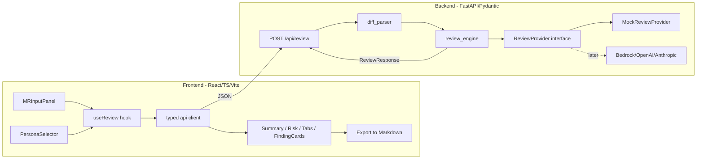

# MR Review Council — MVP Plan

A multi-persona AI merge-request reviewer. The MVP runs fully locally using a deterministic **mock review provider** hidden behind a provider interface, so a real Bedrock/OpenAI/Anthropic backend can drop in later without touching the API or UI.

Defaults I'm choosing (override if you prefer): **npm** for the frontend, a **monorepo** with separate `backend/` and `frontend/` folders, and a single `POST /api/review` endpoint for the MVP.

## Architecture Overview




Flow: user pastes/uploads a diff and picks personas, frontend POSTs to `/api/review`, backend parses the unified diff into files/hunks/lines, the review engine runs each selected persona through the provider, and a structured `ReviewResponse` (overall risk, merge recommendation, summary, per-persona findings) comes back for display and Markdown export.

## Proposed Folder Structure

```text
to-review-or-not-to-review/
  README.md                      # top-level: what it is + quickstart
  backend/
    README.md
    requirements.txt
    app/
      main.py                    # FastAPI app, CORS, router includes
      core/config.py             # settings (provider choice, CORS origins)
      api/routes/review.py       # POST /api/review
      api/routes/health.py       # GET /api/health
      models/enums.py            # Persona, RiskLevel, MergeRecommendation, Severity
      models/diff.py             # DiffLine, Hunk, DiffFile, ParsedDiff
      models/review.py           # ReviewRequest, Finding, PersonaReview, ReviewResponse
      services/diff_parser.py    # unified-diff -> ParsedDiff
      services/review_engine.py  # orchestrates personas via provider
      services/providers/base.py        # ReviewProvider ABC/Protocol
      services/providers/mock_provider.py
      personas/registry.py       # persona metadata + heuristics
    tests/
      test_diff_parser.py
      test_review_engine.py
  frontend/
    README.md
    package.json
    vite.config.ts
    tsconfig.json
    index.html
    src/
      main.tsx
      App.tsx
      api/client.ts             # typed fetch wrapper
      types/review.ts           # TS mirror of backend schemas
      hooks/useReview.ts
      lib/exportMarkdown.ts
      components/
        MRInputPanel.tsx
        PersonaSelector.tsx
        ReviewSummary.tsx
        RiskBadge.tsx
        ReviewerTabs.tsx
        FindingCard.tsx
        ExportMarkdownButton.tsx
      styles/                   # minimal CSS modules / plain CSS
```

## Key Data Models (Pydantic, mirrored in TS)

Enums:

- `Persona`: `architect | qa | security | frontend | backend | sre | product`
- `RiskLevel`: `low | medium | high | critical`
- `MergeRecommendation`: `approve | approve_with_comments | request_changes | block`
- `Severity`: `info | low | medium | high | critical`

Diff models (`models/diff.py`):

- `DiffLine { kind: "context"|"add"|"del", content, old_lineno?, new_lineno? }`
- `Hunk { header, old_start, old_count, new_start, new_count, lines: DiffLine[] }`
- `DiffFile { old_path, new_path, change_type: "added"|"modified"|"deleted"|"renamed", hunks: Hunk[] }`
- `ParsedDiff { files: DiffFile[], stats }`

Review models (`models/review.py`):

- `ReviewRequest { diff_text: str, personas: Persona[], source?: "gitlab"|"github" }`
- `Finding { id, persona, severity, category, title, message, file_path?, hunk_index?, line?, suggestion? }`
- `PersonaReview { persona, risk_level, summary, findings: Finding[] }`
- `ReviewResponse { overall_risk: RiskLevel, merge_recommendation, summary, persona_reviews: PersonaReview[], stats }`

## Provider Abstraction (the extensibility seam)

`services/providers/base.py` defines:

```python
class ReviewProvider(Protocol):
    def review(self, diff: ParsedDiff, personas: list[Persona]) -> list[PersonaReview]: ...
```

`MockReviewProvider` generates deterministic findings from simple diff heuristics (e.g. Security flags added `eval(`/hardcoded secrets/`http://`; QA flags missing test files; SRE flags removed logging) so the full flow is realistic offline. The engine aggregates persona results into overall risk + merge recommendation. A future `BedrockReviewProvider` implements the same `Protocol` and is selected via `core/config.py`.

## Implementation Phases

- **Phase 1 — Backend foundation**: FastAPI skeleton, enums + diff models, `diff_parser.py`, `/api/health`, parser unit tests.
- **Phase 2 — Review engine + mock provider**: `ReviewProvider` interface, `MockReviewProvider` with per-persona heuristics, `review_engine.py` aggregation, `POST /api/review`, engine tests.
- **Phase 3 — Frontend foundation**: Vite app, TS types mirroring schemas, typed API client, `MRInputPanel` (paste + `.diff`/`.patch` upload), `PersonaSelector`.
- **Phase 4 — Results UI**: `ReviewSummary`, `RiskBadge`, `ReviewerTabs`, `FindingCard`, `useReview` wiring.
- **Phase 5 — Export + polish**: `exportMarkdown.ts` + button, loading/error states, README quickstart, sample `.diff` fixture.

## Commands To Run Locally

Backend:

```bash
cd backend
python -m venv .venv && source .venv/bin/activate
pip install -r requirements.txt
uvicorn app.main:app --reload --port 8000
```

Frontend:

```bash
cd frontend
npm install
npm run dev
```

Frontend dev server proxies `/api` to `http://localhost:8000` (configured in `vite.config.ts`).

## Risks / Tradeoffs

- **Diff parsing edge cases**: rename/binary/no-newline-at-EOF hunks. Mitigation: support standard unified diff first, degrade gracefully on unknown lines, cover with fixtures.
- **Mock realism vs. simplicity**: heuristics must look credible without overbuilding. Keep them small and per-persona; clearly isolated so the real provider replaces them cleanly.
- **Schema drift between Python and TS**: hand-mirrored types can diverge. Mitigation: keep one source of truth in `models/review.py`; optionally generate the OpenAPI/TS types later.
- **Scope creep**: no auth, no DB, no real Git API integration in the MVP (paste/upload only). AWS/persistence deferred.

## What I'll Build First

Phase 1: backend skeleton, the Pydantic enums + diff/review models, and `diff_parser.py` with unit tests — the parser is the foundation everything else depends on.