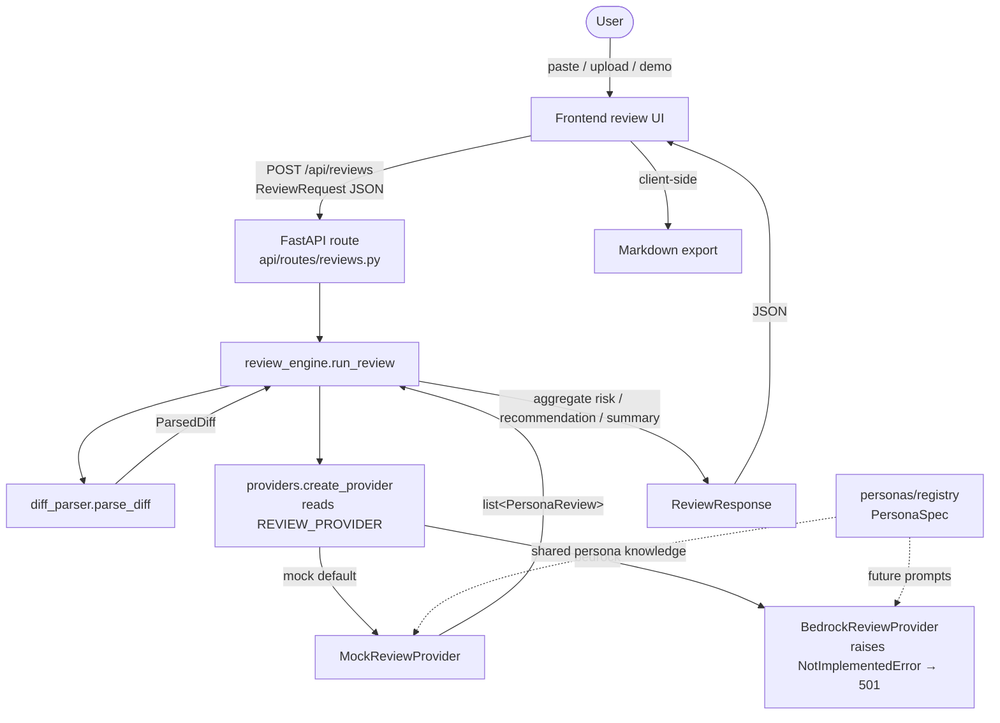

# Architecture

MR Review Council (repo: *To Review or Not To Review*) is a multi-persona
merge-request review assistant. The MVP is **local-first**: a deterministic mock
provider produces reviews behind a pluggable interface, so a real AI provider can
be added later without touching the API or UI.

## System overview

```text
Frontend (React/TS/Vite)                 Backend (FastAPI/Pydantic)
┌─────────────────────────┐  POST /api   ┌────────────────────────────────────────┐
│ Diff input (paste/upload │ ──/reviews─► │ diff_parser   → ParsedDiff             │
│   /demo) + persona pick  │              │ review_engine → aggregates results     │
│ Risk/verdict dashboard   │ ◄──JSON───── │   create_provider(REVIEW_PROVIDER)     │
│ Tabs · filters · cards   │              │     ReviewProvider (interface)         │
│ Export to Markdown       │              │       MockReviewProvider  (default)    │
└─────────────────────────┘              │       BedrockReviewProvider (placeholder)│
                                          │ personas/registry → PersonaSpec(s)     │
                                          └────────────────────────────────────────┘
```

## Request flow



## Components

### Diff parser (`app/services/diff_parser.py`)
Converts raw unified-diff / patch text into a structured `ParsedDiff`: a list of
`DiffFile`s (with change type and old/new paths), each containing `DiffHunk`s and
classified `DiffLine`s (added / removed / context) with line-number tracking,
plus aggregate `DiffStats`. Pure and deterministic; no I/O.

### Review engine (`app/services/review_engine.py`)
Orchestration + aggregation only. It parses the diff, resolves the configured
provider via `create_provider()`, dedupes the selected personas, asks the
provider for one `PersonaReview` per persona, then aggregates:
- **overall risk** (highest finding severity present),
- **merge recommendation** (`ready` → `ready_with_followups` → `needs_changes` →
  `needs_human_review`, escalating when a security/architect high finding exists),
- **summary** (headline + severity breakdown), and
- a **flattened findings** list for display.

The engine is provider-agnostic; the `ReviewResponse` contract is identical no
matter which provider runs.

### Provider abstraction (`app/services/providers/base.py`)
A single `ReviewProvider` ABC:

```python
review(parsed_diff, selected_personas, title=None, description=None) -> list[PersonaReview]
```

Providers only produce per-persona reviews; cross-persona aggregation stays in
the engine. Selection is via `create_provider()` (`providers/__init__.py`), which
reads `REVIEW_PROVIDER` from `app/core/config.py`, validates it, and raises a
clear `ValueError` (listing valid options) on anything unknown.

### Mock provider (`app/services/providers/mock_provider.py`)
The default. Deterministic heuristics over the parsed diff produce credible
findings per persona (e.g. Security flags `eval(`, tokens, `shell=True`; QA flags
production changes without tests; SRE flags removed logging and missing
timeouts). Same diff + personas ⇒ identical output. No AI, no network.

### Bedrock placeholder (`app/services/providers/bedrock_provider.py`)
The integration seam for a future Amazon Bedrock model. It deliberately does
**not** import boto3, read credentials, or call AWS. If selected it raises
`NotImplementedError`, which a FastAPI exception handler in `app/main.py` maps to
a clear **HTTP 501** with an explanatory message — so the app fails loudly rather
than faking a review.

### Persona registry (`app/personas/registry.py`)
One `PersonaSpec` per persona — `id`, `display_name`, `description`,
`review_focus`, `output_expectations`, `severity_guidance` — plus a
`persona_prompt()` renderer. This is the single source of persona knowledge: the
mock provider uses it for display/summaries, and a future LLM provider can build
prompts from the same specs instead of duplicating them.

## Key data models

- **Enums:** `ReviewerPersona`, `RiskLevel`, `MergeRecommendation`, `FindingSeverity`
- **Diff:** `DiffLine`, `DiffHunk`, `DiffFile`, `DiffStats`, `ParsedDiff`
- **Review:** `ReviewRequest`, `ReviewFinding`, `HunkReference`, `PersonaReview`,
  `ReviewSummary`, `ReviewResponse`

The Pydantic models on the backend are the source of truth and serialize to
camelCase JSON; the frontend mirrors them in TypeScript
(`frontend/src/types/review.ts`). See [`review-contract.md`](review-contract.md).

## Where AWS / Bedrock / DynamoDB / S3 fit later

The MVP intentionally has no cloud dependencies. The architecture leaves obvious
seams for them:

- **Amazon Bedrock (reviews).** Implement `BedrockReviewProvider.review()`:
  build a prompt per persona via `persona_prompt(spec)`, call a Bedrock model
  (e.g. Anthropic Claude on Bedrock), and parse the response into
  `ReviewFinding` / `PersonaReview` objects. Nothing else changes — the engine,
  API contract, and UI are already provider-independent.
- **DynamoDB (persistence).** Store submitted reviews and their results keyed by
  an id, enabling review history and shareable links. Would slot in around the
  `/api/reviews` route (write-through after `run_review`).
- **S3 (artifacts).** Persist exported Markdown reports / large diffs and serve
  them via signed URLs instead of (or in addition to) the client-side download.
- **API Gateway + Lambda / ECS (hosting).** The FastAPI app can run behind API
  Gateway + Lambda (e.g. Mangum) or as a container on ECS; the frontend builds to
  static assets suitable for S3 + CloudFront.
- **Auth / VCS integration.** GitLab/GitHub OAuth + diff fetch would live in front
  of the existing request flow, replacing manual paste/upload with fetch-by-URL.

## Current status

MVP complete and runnable locally end to end: diff parsing, the deterministic
mock review engine behind a provider interface, the `bedrock` placeholder, the
full React review dashboard (input, personas, tabs, filters, finding cards), and
client-side Markdown export. No real AI integration, authentication, VCS
integration, or persistence yet — these are deliberate, documented deferrals.
